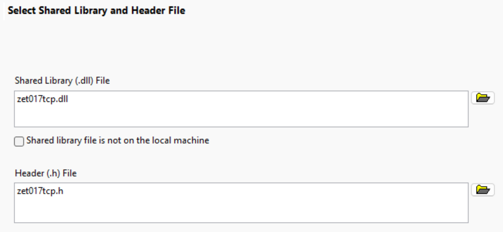
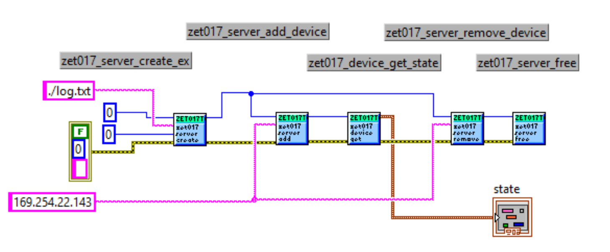

# ZET 017 — split into two libraries

*[Русская версия](README.md)*

XML parsing has been moved out of the main library into a separate module. The
main library `zet017tcp` no longer depends on libxml2.

## Origin and licence

This project is based on the [zetlab/zet017tcp](https://github.com/zetlab/zet017tcp)
library and is distributed under the same terms — MIT,
`Copyright (c) 2023 ZETLAB`; the full text is in the `COPYING` file.

It is not a fork of that repository but independent work derived from it: the
directory structure has been changed — the library moved into `zet017tcp/`,
with the `zet017config/` module added alongside it. A line-by-line comparison
with the original is therefore uninformative, so what follows is what this
version changes.

**The original public API is preserved in full.** All fourteen of its functions
are present, with the same signatures and return codes. Six new ones have been
added.

**New `zet017config` module.** Reading and writing `devices.cfg`. The libxml2
dependency is confined to it, which keeps the main library free of external
dependencies. The original has no such module.

**Logging.** A text log with four severity levels and an independent threshold
for each of four message categories. Adds `zet017_server_create_ex`,
`zet017_server_set_log_level`, `zet017_server_set_log_category_level` and
`zet017_server_set_log_file`.

**Reading all channels in one call.** `zet017_channel_get_all_data` and
`zet017_channel_get_all_frame_data` take every active channel under a single
mutex acquisition, from one window of the ring buffer. With per-channel reads
the mutex is released between calls and the receiving thread has time to
overwrite the beginning of the window — the first channel ends up read before
the overwrite and the last one after it. The two functions differ only in the
layout of the destination buffer.

## Layout

```
zet017tcp/                  ← MAIN library (no external dependencies)
├── include/zet017tcp.h
├── src/zet017tcp.c
├── win32/zet017tcp.def
├── CMakeLists.txt          ← no libxml2/vcpkg
└── CMakePresets.json       ← no manifest mode (vcpkg not needed)

zet017config/               ← SEPARATE XML module (depends on libxml2)
├── include/zet017config.h
├── src/zet017config.c
├── win32/zet017config.def
├── CMakeLists.txt          ← find_package(LibXml2)
├── CMakePresets.json       ← vcpkg manifest mode
└── vcpkg.json              ← libxml2 dependency

example_usage.c             ← example of linking both modules
```

## The idea

- `zet017config.dll` — two functions: `zet017_config_load_file(...)` reads XML
  into the `zet017_cfg_config` / `zet017_cfg_tenso_config` structures, and
  `zet017_config_save_file(...)` writes them back to the file. The module never
  talks to the device.
- Sending is done by the client through `zet017tcp.dll`
  (`zet017_device_set_config` / `zet017_device_set_tenso_config`).
- The structures in both headers are binary identical (verified with
  `offsetof`/`sizeof` on x86 and x64), so the pointer can safely be cast
  between modules.

## Architecture: Opaque Pointer, the silent pointer and a flat C ABI

The library is built around two requirements that determine the remaining
design decisions: deterministic behaviour when arguments are only partially
supplied, and invocation from an environment whose only capabilities are
resolving a symbol by name and passing arguments according to a binary
convention.

### The Opaque Pointer pattern and state retention

A session with a device does not fit into a single call. After
`zet017_server_add_device` returns, the worker thread keeps running: it holds
the command and stream sockets open, reconnects on a drop, and continuously
fills the ADC ring buffer. The next call to `zet017_channel_get_all_data` must
land in that very same state — the same sockets, the same buffer, the same
counters.

The state must therefore outlive the return from the DLL function. Keeping it
on the caller's side is impossible: it consists of `mutex_t` and `cond_t`, the
thread handle `thread_t`, the sockets `socket_t`, the log `FILE*` and a
multi-megabyte ring buffer. All of these are declared conditionally per
platform — `CRITICAL_SECTION` versus `pthread_mutex_t`, `HANDLE` versus
`pthread_t` — and differ in size and layout between builds. They have no
representation in LabVIEW or Python, and none is needed: these types exist only
inside the C implementation.

Allocation and ownership therefore rest entirely with the library:

1. `zet017_server_create` allocates `struct zet017_server`, places the pointer
   into the static `g_servers` registry inside the DLL and returns the slot
   index as `zet017_handle`.
2. `zet017_server_add_device` allocates `struct zet017_device`, starts a worker
   thread for it and links the device into the server's list.
3. Every subsequent call converts the `handle` back into a pointer
   (`registry_get`) and operates on the same structures.
4. `zet017_server_free` releases everything and zeroes `*handle`.

Between calls the caller stores a single value — an `int32_t`. It allocates no
memory for the session state and releases nothing.

The practical consequence for LabVIEW: the handle is placed into a shift
register and carried from iteration to iteration. Losing it means a leak — the
structures stay in the registry, the worker threads keep running, and the log
file stays open (see the section on the Abort Execution button).

### The silent pointer pattern

Every pointer in the public API is assigned to one of two categories, and the
category is fixed for the lifetime of the function:

- **Required** (non-nullable). `NULL` is treated as a refusal: the function
  returns a negative code and produces no side effects. A partial write into
  the buffer, a partially modified file and a changed device state are all
  excluded — a refusal satisfies the strong, all-or-nothing guarantee.
- **Optional, that is, silent** (nullable). `NULL` means the corresponding part
  of the work is not required. The function skips it and returns 0; with
  respect to that part the call is a no-op. This is a normal scenario, not a
  suppressed error.

The rule holds across the whole API:

| call | result of passing `NULL` |
|---|---|
| `zet017_server_create(&h, NULL)` | server created, file logging disabled |
| `zet017_server_set_log_file(h, NULL)` | logging disabled, file released |
| `zet017_config_load_file(..., tenso_config = NULL)` | the `<Channels>` section is not read |
| `zet017_config_save_file(..., tenso_config = NULL)` | the `<Channels>` section in the file is not modified |
| `zet017_channel_get_all_data(..., channels = NULL)` | the channel count is not returned |

The same principle extends to data, not only to pointers. When reading a
configuration, an element absent from the file leaves the corresponding struct
field unchanged; when writing, a value absent from the struct does not cause an
element to be created in the file. Data the module does not manage passes
through it unmodified.

The consequence for the calling side is that no dummy arguments have to be
constructed for the sake of signature completeness, and refusals do not have to
be classified by severity. A negative return code means nothing was performed;
zero means exactly what was requested was performed.

### Grounds for invocation from an arbitrary language

The headers contain no constructs specific to C++: no classes, no templates, no
function overloading, no exceptions, no references. Consequently there is no
name mangling, which is what otherwise makes the symbol in the DLL export table
diverge from the identifier in the source text.

The set of decisions:

- **Calling convention.** `ZET017_TCP_API` expands to `int __stdcall` — the
  convention used by WinAPI functions and expected by import tooling on 32-bit
  Windows. On other platforms the macro expands to `int`.
- **Exports via `.def`.** Names are placed in the export table without
  decoration: `zet017_device_get_config`, not `_zet017_device_get_config@12`.
  `CMAKE_WINDOWS_EXPORT_ALL_SYMBOLS` is deliberately disabled; `win32/*.def` is
  the single source of truth for what is exported.
- **Opaque Pointer** — see the dedicated subsection below. What crosses the
  boundary is `zet017_handle`, which is an `int32_t`; the value `0` is invalid.
- **POD structures only** (plain old data). Fixed-width integer types are
  declared explicitly in the header, without `<stdint.h>`: the MSVC system
  header is not self-contained and header parsers cannot process it. The ABI
  description nevertheless remains complete.
- **No callbacks.** Feedback is implemented by polling: the calling side reads
  the state (`zet017_device_get_state`) and the data into a buffer it allocated
  itself. The library does not transfer control to external code and does not
  return memory that the caller would have to free.
- **Diagnostics through return codes only.** Exceptions, `errno` and global
  error state are not used.

Together these form a flat C ABI, handled uniformly by LabVIEW, C#, Python,
Delphi, Rust and other environments that provide an FFI:

```csharp
// C#
[DllImport("zet017tcp.dll", CallingConvention = CallingConvention.StdCall)]
static extern int zet017_server_create(ref int handle, string logPath);
```

```python
# Python: on Windows it must be WinDLL — that is stdcall
import ctypes
lib = ctypes.WinDLL("zet017tcp.dll")
h = ctypes.c_int32(0)
lib.zet017_server_create(ctypes.byref(h), None)   # None is a silent pointer
```

The specifics of importing into LabVIEW are covered in a separate section below.

## Client-side sequence (LabVIEW)

To configure a device from a file:

1. `zet017_device_get_config` / `get_tenso_config` — take the factory configuration;
2. `zet017_config_load_file` — overlay the values from XML;
3. `zet017_device_set_config` / `set_tenso_config` — send to the device.

To save the current settings back to a file:

1. `zet017_device_get_config` / `get_tenso_config` / `get_info`;
2. `zet017_config_save_file(directory, file name, info.serial, ...)`.

## Reading channel data

The ADC ring buffer is filled by the device worker thread, while the read
position is maintained by the client. The library does not store it:
`zet017_state.pointer_adc` is the **writer** position, expressed in samples per
channel.

All three reading functions take `pointer` and `size` in samples per channel
and read **backwards** — the window returned is `[pointer - size, pointer)`.

### Per channel and all channels at once

| function | `data` layout |
|---|---|
| `zet017_channel_get_data` | one channel, `data[i]` |
| `zet017_channel_get_all_data` | `data[k * size + i]` — samples of a channel contiguous |
| `zet017_channel_get_all_frame_data` | `data[i * n + k]` — channels interleaved, as in the ring |

Here `n` is the number of active channels, which is also returned in
`channels`.

Reading all channels in a single call is not about convenience. With per-channel
reads the internal mutex is released between calls, and the receiving thread has
time to overwrite the beginning of the window: the first channel ends up read
before the overwrite and the last one after it, i.e. from the next lap of the
ring. The `..._get_all_*` functions take all channels under a single lock, from
one window. For calculations where channels are compared against each other
(measurement against reference) this is a hard requirement.

Both layouts produce the same numbers and differ only in order. The planar one
requires no rearranging either in C or in LabVIEW; the interleaved one mirrors
the ring order and copies roughly 40 % faster inside the DLL, but the caller has
to unpack it.

### Which row is which channel

`k` is the ordinal number among the **enabled** channels, not the channel
number. With `mask_channel_adc = 0b101` (channels 0 and 2), `k = 0` is channel 0
and `k = 1` is channel 2. The mapping is recovered from
`zet017_config.mask_channel_adc`; the number of active channels is returned by
the `channels` parameter.

### Buffer size

The buffer is allocated by the caller, at least `channels * size` `float`
elements. The library cannot determine the size of someone else's buffer, so it
requires `capacity` — how many elements fit into it. If that is too small, −7 is
returned, nothing is written into `data`, and the required number of channels is
placed into `*channels`, so the needed size is learned rather than guessed.
`channels` may be `NULL` if it is not wanted.

### Return codes of `..._get_all_*`

```
 0  success
-1  invalid handle or device not found
-3  no connection to the device
-4  data == NULL
-6  pointer or size outside the ring buffer
-7  capacity too small (*channels holds the required channel count)
```

### In LabVIEW

- `zet017_channel_get_all_data` — the `data` parameter is declared as a
  **2D Array of Single** passed as Array Data Pointer; rows are channels,
  columns are samples, and a given channel is taken with Index Array.
- `zet017_channel_get_all_frame_data` — **Array of Single** (1D); unpacking is
  done with Reshape Array to (`size` × `n`) followed by Transpose Array, or with
  Decimate 1D Array.
- `channels` — a pointer to U32; leave the terminal unwired only when passing
  `NULL`.

The signatures of both functions are identical, so comparing the two layouts on
a test rig requires no rewiring of the CLFN terminals — only the function name
changes.

## Saving: a donor file is required

`zet017_config_save_file` **does not create** a file, it updates an existing
one; if the file is absent, −2 is returned.

The reason is that a real `devices.cfg` is considerably wider than what the
module deals with: about thirty elements per device and some fifteen per
channel, a `KodAmplify` list of 32 positions, a separate generator channel.
These values arrive from the device in the internal `zet017_device_info`
structure (`zet017tcp.c`), which is not exposed, and only a small part of it
reaches `struct zet017_config`:

| `devices.cfg` element | `zet017_device_info` field | present in `zet017_config`? |
|---|---|---|
| `Amplitude`, `DigitalResolChanADC` | `resolution_adc[16]` | no |
| `Atten` | `atten[4]` | no |
| `DigitalInput/Output/OutEnable` | `digital_input`, `digital_output`, … | no |
| `sizeInterrupt` | `size_packet_adc` | no |
| `ChannelDAC` | `mask_channel_dac` | no |
| `name`, `type`, `configTime` | `device_name` and ZETLAB metadata | partly |

Writing therefore updates only its own elements and carries the rest of the file
over as it is — including Windows-style line endings, indentation, the space in
empty tags (`<AFCH />`) and Cyrillic text in attributes. The one line that always
changes is the XML declaration: `encoding="UTF-8"` is added to it, without which
libxml2 replaces Cyrillic characters in attributes with character references
(`№` becomes `&#x2116;`).

The file is replaced through a temporary file next to it, so a failed write
leaves the original intact. Saving the same structures again does not change the
file.

What exactly gets written, and how the "rate versus raw code" precedence is
resolved, is documented in the function comment in `zet017config.h`.

## Building

The main library (vcpkg NOT needed):
```
cmake --preset vs-x86      # or vs-x64
cmake --build out/build/vs-x86
```

The XML module (vcpkg pulls libxml2 in automatically from vcpkg.json):
```
cmake --preset vs-vcpkg-x86
cmake --build out/build/vs-vcpkg-x86
```

The `vs-vcpkg-*` presets take the toolchain file from the `VCPKG_ROOT`
environment variable, so it has to be set before configuring:
```
set VCPKG_ROOT=C:\vcpkg
```

`set` only lasts until the cmd window is closed. Visual Studio and CLion
start as separate processes and will not see such a variable, so when
building from an IDE set it permanently and restart the IDE:
```
setx VCPKG_ROOT C:\vcpkg
```

The same can be done through Environment Variables in the system
properties. The vcpkg bundled with CLion lives in
`%USERPROFILE%\.vcpkg-clion\vcpkg`.

If you would rather not set the variable, override `CMAKE_TOOLCHAIN_FILE`
in a `CMakeUserPresets.json` next to `CMakePresets.json` — that file is
not committed.

## Deployment for LabVIEW

- Always next to the application: `zet017tcp.dll` (standalone, no dependencies).
- Only if XML parsing is needed: additionally `zet017config.dll` plus the
  accompanying libxml2 DLLs (check with `dumpbin /dependents zet017config.dll`:
  usually `libxml2.dll` and, with those features enabled, zlib/iconv/lzma).
- The bitness of the DLL must match LabVIEW (32-bit → x86 builds).

## Importing into LabVIEW (Import Shared Library)

Both headers (`zet017tcp.h` and `zet017config.h`) are made SELF-CONTAINED: they
do not include `<stdint.h>` but declare the fixed-width types by hand
(`zet017_uint32` and so on via `unsigned __int32`). This is needed because the
LabVIEW import wizard cannot always parse the system stdint.h from a modern MSVC
(the "uint32_t not defined" error).

The first step of the wizard asks for the DLL itself and its header:



Then, through the remaining steps:
- Include Paths — may be left EMPTY;
- Preprocessor Definitions — leave EMPTY;
- Calling Convention = **stdcall (WINAPI)**, since the API is declared as
  `int __stdcall`. The wizard offers "C" by default — you must change it.

### Minimal example

A block diagram of the full device lifecycle: create the server, add a device
by IP, read its state, remove the device, free the server.



The server handle runs along the upper wire from `create_ex` through every
subsequent node and finally into `free` — this is the `int32_t` the calling
side keeps between calls. The error cluster (the lower wire) enforces the
execution order of the nodes: the DLL functions impose no ordering by
themselves.

The two zeros on the `create_ex` inputs are `handle` (filled in by the
function) and the logging `level`; the numeric values of the levels are listed
in the logging section.

The log path in the example is relative (`./log.txt`) to keep the diagram
compact. In a working VI it must be **absolute**: LabVIEW's current directory
is unpredictable — see the requirements in the logging section.

## Logging

`zet017tcp` writes a text log with severity levels and a per-category filter.
`zet017config` does not log — its API is synchronous and errors come back as
return codes.

### Levels and categories

The import wizard does not carry constant names over from the header, so the
`level` and `category` inputs appear in LabVIEW as plain I32. The numeric values:

| level | Name | What gets written |
|---|---|---|
| 0 | off | nothing |
| 1 | error | failure of a resource or a subsystem |
| 2 | warning | + expected situations that were handled |
| 3 | info | + normal events |

| category | Tag in the file | What it covers |
|---|---|---|
| 0 | `API` | entry/exit of public functions, argument validation |
| 1 | `NET` | connecting, drops, reconnects |
| 2 | `CMD` | execution of device commands |
| 3 | `DATA` | ADC stream: intake rate, buffer overrun |

Each level includes the previous ones. It is convenient to define a type-def Enum
with these values on the LabVIEW side.

### Functions

```c
zet017_server_create(&h, "C:\\ProgramData\\zet\\zet017.log");        /* = create_ex(..., 3) */
zet017_server_create_ex(&h, "C:\\ProgramData\\zet\\zet017.log", 3);
zet017_server_set_log_level(h, 2);              /* warning for all categories */
zet017_server_set_log_category_level(h, 0, 1);  /* API -> error only          */
zet017_server_set_log_file(h, NULL);            /* switch off and release the file */
```

A typical setup for an acquisition loop: info for all categories, and error for
the `API` category. The `channel_get_data: entry/success` spam then disappears,
while network events, command errors and buffer overruns remain.

The setters may be called at any moment from any VI, in parallel with a running
acquisition.

### Line format

```
=== 2026-08-28 13:06:12 zet017tcp 1.0.1 (x86) log session started (level=info) pid=7412 exe=LabVIEW.exe ===
[2026-08-28 13:06:12.418] [INFO] [NET] connected (ip=192.168.0.55, name=ZET 058, serial=711347, reconnect #1)
[2026-08-28 13:06:41.902] [WARN] [DATA] adc buffer overrun (number=0, channel=0, behind=51200, size=4096, window=52488, lost=2808)
```

Times are local, not UTC. The file is opened for appending and is not rotated.
The banner contains the PID and the process name: the LabVIEW development
environment and a built EXE may write into the same file simultaneously, and
`pid=` lets the lines be told apart afterwards.

The `adc buffer overrun` message means the polling loop did not keep up with the
device and part of the requested window has already been overwritten: `lost` is
how many frames were lost. It appears at most once per second per device.

### Mandatory requirements

**Call Library Function Node thread mode — "Run in any thread".** By default the
node sits in "Run in UI Thread": the log write from `channel_get_data` then
happens in the LabVIEW UI thread, freezes the front panel and serialises calls
from all VIs. The DLL is thread-safe; there are no restrictions on the mode.

**The log file path must be absolute and ASCII-only.** The current directory in
LabVIEW is unpredictable: a relative path will land either next to `LabVIEW.exe`
or next to the built EXE, and an application under `Program Files` cannot write
next to itself. Sensible places are `%LOCALAPPDATA%` or
`C:\ProgramData\<application>\`. Cyrillic characters in the path are not
supported (`fopen` works with the ANSI code page). The maximum length is 259
characters.

**How to find out that the log did not open.** In `create`/`create_ex` a failure
to open the file is not treated as an error: the server is created and logging is
silently disabled — logging must not break initialisation. If the error code is
needed, create the server without a log and enable it separately:

```c
zet017_server_create(&h, NULL);
int r = zet017_server_set_log_file(h, "C:\\ProgramData\\zet\\zet017.log");
/* r == -4: the file could not be opened, or the path is longer than 259 characters */
```

**The Abort Execution button.** It does not call `zet017_server_free`: the file
stays open, the worker threads keep running, and the next Run creates a second
server and appends a second banner to the same file. This is expected; such
overlaps are untangled by time and by `pid=` in the banners. To release the file
properly, call `zet017_server_set_log_file(h, NULL)` or `zet017_server_free`.

## Important when changing the structures

The definitions of `zet017_cfg_config` / `zet017_cfg_tenso_config` in
`zet017config.h` are duplicated deliberately (to keep the module independent). If
the fields of `struct zet017_config` / `zet017_tenso_config` in `zet017tcp.h`
change, synchronise them in `zet017config.h` as well.

For the same reason `zet017config.c` duplicates the "value ↔ raw code"
conversion tables (`zet017_cfg_get_mode_adc` and its neighbours). Saving must
resolve field precedence exactly the way `zet017_device_set_config` does,
otherwise what lands in the file will differ from what goes to the device. If the
tables in `zet017tcp.c` (`zet017_get_mode_adc`, `zet017_get_sample_rate_adc`,
`zet017_get_rate_dac`, `zet017_get_amplify_code`) change, fix them here too.
